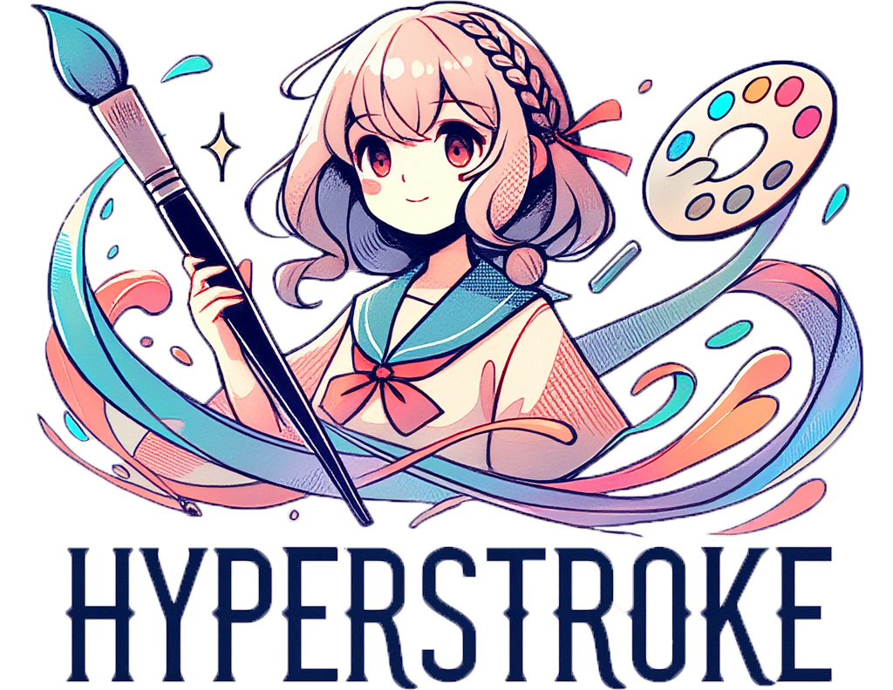
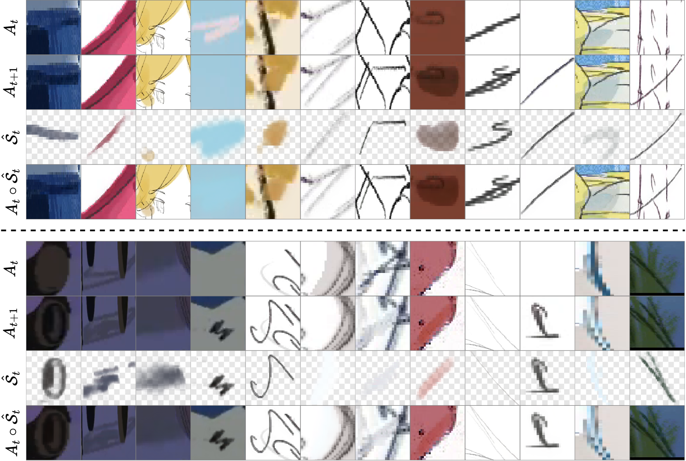
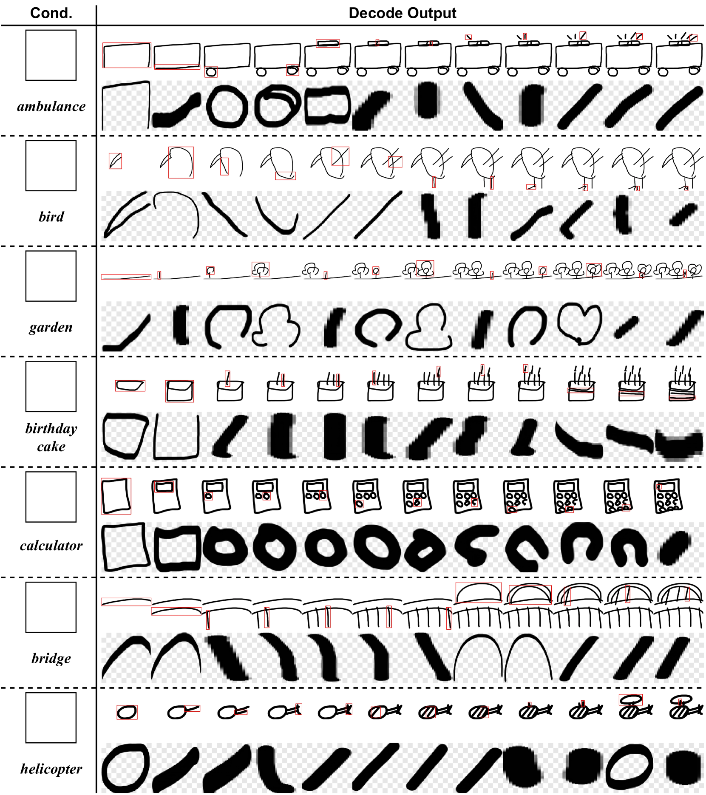
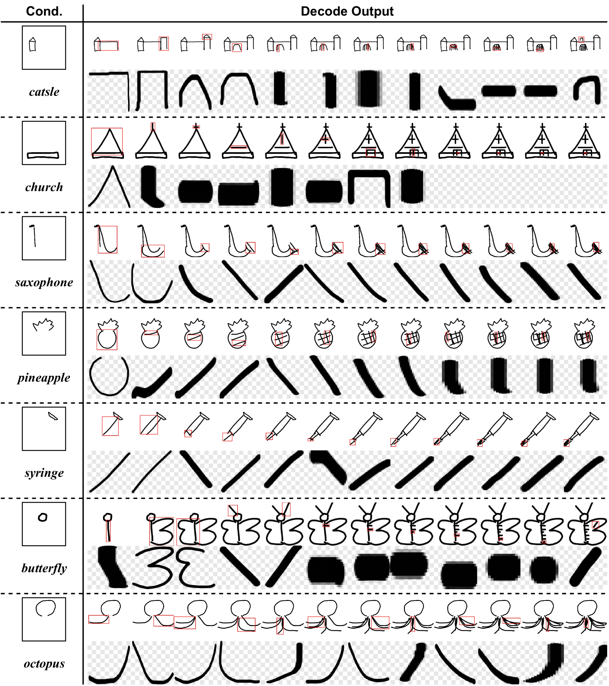

<div align="center">
    <h1>Hyperstroke: A Novel High-quality Stroke Representation for Assistive Artistic Drawing</h1>
    <br><br>
    <a href="https://haoyunqin.com">Haoyun Qin</a>, <a href="https://github.com/dmMaze">Jian Lin</a>, <a href="https://github.com/hyliu">Hanyuan Liu</a>, Xueting Liu, <a href="https://moeka.me">Chengze Li</a><br> <em>SIGGRAPH Asia 2024</em><br><br>
    <a href="https://asia.siggraph.org/2024/"></a>
    <a href="https://arxiv.org/abs/2408.09348"></a>
    <a href="https://dl.acm.org/doi/10.1145/3681758.3697985"></a>
    <a href="https://haoyunqin.com/files/papers/hyperstroke-dl.pdf"></a>
    <a href="https://haoyunqin.com/files/papers/hyperstroke-sup.pdf"></a>
    <a href="https://haoyunqin.com/files/papers/hyperstroke-arxiv.pdf"></a>
    <a href="https://haoyunqin.com/files/papers/hyperstroke-slide.pdf"></a><br>
    <a href="https://github.com/JeffersonQin/hyperstroke"></a>
    <a href="https://huggingface.co/collections/gyrojeff/hyperstroke-67ac3a1551c7f3b53f0200a5"></a>
    <a href="https://huggingface.co/gyrojeff/Hyperstroke-Quickdraw"></a>
    <a href=""></a>
    <a href=""></a>
</div>

## 🔆 Introduction

Assistive drawing aims to facilitate the creative process by providing intelligent guidance to artists. Existing solutions often fail to effectively model intricate stroke details or adequately address the temporal aspects of drawing. We introduce hyperstroke, a novel stroke representation designed to capture precise fine stroke details, including RGB appearance and alpha-channel opacity. Using a Vector Quantization approach, hyperstroke learns compact tokenized representations of strokes from real-life drawing videos of artistic drawing. With hyperstroke, we propose to model assistive drawing via a transformer-based architecture, to enable intuitive and user-friendly drawing applications, which are experimented in our exploratory evaluation.

### 🌈 Representation Showcase

We demonstrate the effectiveness of our hyperstroke representation on both real-life timelapse drawing data and synthetic dataset.



*Hyperstroke model result on real-life timelapse drawing data. For each group, the four rows from the top to the bottom stand for the previous frame, the latter frame, the predicted strokes between the two frames, and finally the blended result of the predicted strokes onto the initial frames.*


*Hyperstroke model result on synthetic dataset. For each group, the five rows from the top to the bottom stand for the original cropped illustration, the generated ground truth stroke images, the blended illustration by the ground truth, the predicted strokes between the two frames, and finally the blended result of the predicted strokes.*

### 🌈 Autoregressive Generation Showcase

Our generation model is trained and evaluated on the QuickDraw dataset.



*Results on assistive sketch generation from blank canvas, conditioned on seen text categories.*



*Results on assistive sketch generation, conditioned the raster canvas images and seen text categories.*

## ⚙️ Setup

```bash
conda create -n hyperstroke python=3.10
conda activate hyperstroke
pip install -r requirements.txt
```

## 💫 Inference

### Example Script

To test Quickdraw generation, run the following command:

```bash
python inference/generation.py
```

To test VQ stroke reconstruction, run the following command:

```bash
python inference/representation.py
```

### Gradio Demo

Coming soon.

## 😉 Citation

```bibtex
@incollection{qin2024hyperstroke,
  title={Hyperstroke: A Novel High-quality Stroke Representation for Assistive Artistic Drawing},
  author={Qin, Haoyun and Lin, Jian and Liu, Hanyuan and Liu, Xueting and Li, Chengze},
  booktitle={SIGGRAPH Asia 2024 Technical Communications},
  pages={1--4},
  year={2024}
}
```
